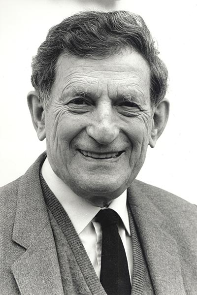
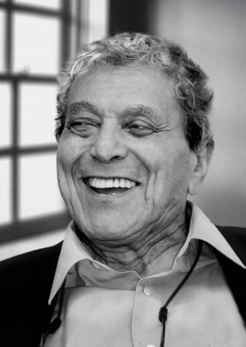
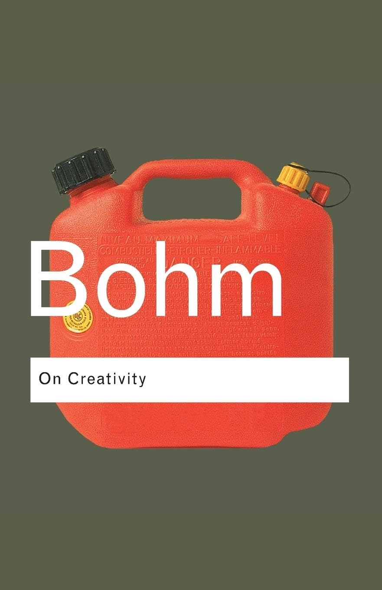
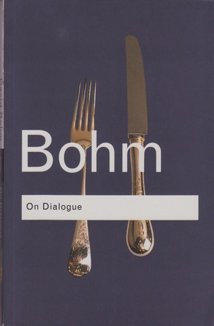
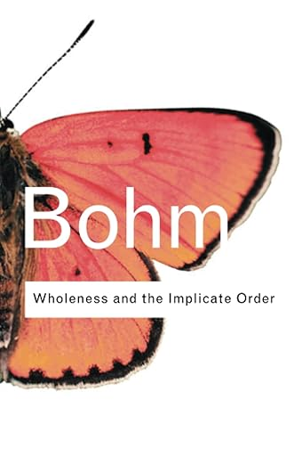
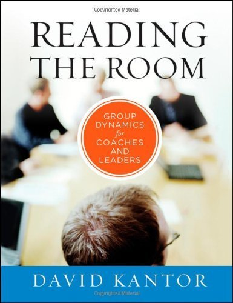

 

#  Dialogue and The Power of Decision-Making

### Perception <b> | </b> Dialogue <b> | </b>  Execution

---

# Thought Leaders Who Inspired Me

  

    
    
Jafar Mossafa

    
 Excessive Thinking 

  

  

    
    
David Bohm

    
 On Dialogue 

  

  

    
    
David Kantor

    
 Reading the Room 

  

---
 

# How Are Thoughts Made?
## The process behind our mental interpretations

- Our thoughts shape how we interpret reality. 
- Mohammadjafar Mosaffa’s work **"Excessive Thinking"** explores how our perceptions often distort the **truth**. 

---

 

# Excessive Thinking

## Interpretation vs. Reality

---

| What is - Fact                 | What we think   - Opinion                    |
|------------------------------|-----------------------------------------|
| Red.                         | Perfect for a healthy snack.           |
| There.                        | Reminds me of my childhood.            |
| On the desk.                  | Too sour.                              |
| Round.                        | Overpriced.                            |
| Has a stem.                   | Represents temptation.                 |

---

---

# The Broken Watch

- Gears, Glass, Hands.

---

# From Perception to Fragmentation

Our perceptions often differ from reality, causing fragmented thinking and incomplete decisions. Bohm’s dialogue **bridges** these gaps, offering clearer choices and helping unify perspectives. It’s not about winning a debate, but about understanding each other and building meaning together.

| Perception                             | Reality                                      |
|--------------------------------------------|--------------------------------------------------|
| Sales drop due to new feature release.    | Competitor launched a marketing campaign.        |

---

# What is Dialogue?

Dialogue is when people share ideas and listen without defending their own views. It’s about understanding each other, suspending judgment, and creating meaning together. It’s not a debate—it’s about finding **shared understanding**.

| Term       | Definition                                          |
|----------------|---------------------------------------------------------|
|Dialogue   | A cooperative exchange aimed at mutual understanding.   |
| Debate     | A competitive argument where each side defends its point of view. |
| Negotiation| A discussion to reach a mutually beneficial agreement.  |
| Conversation| Informal exchange of ideas or information between people. |

---

# Effective Dialogue Principles

- **Suspension of Judgment & Listening to Understand**  
   In meetings, let everyone share their thoughts before deciding.

- **Whole-System Thinking & Collective Intelligence**  
  When planning a new feature, get input from multiple teams, not just development.

- **Co-Creation & Exploration**  
  In brainstorming, ask, "What if we tried this?" to get everyone involved.

- **Flow of Thought**  
  Let discussions unfold before refining them into action points.

---

# Decision-Making Framework

| Decision Type  | Accountability   | Purpose      | Decision Maker    |
|--------------------|----------------------|------------------|-----------------------|
| No Decision    | Inform 🗣️           | Share info 📢     | No decision yet       |
| Your Decision  | Delegate 👥          | Guide 🧭          | The other person      |
| My Decision    | Consult 💬           | Listen & Ask 👂   | You                   |
| Our Decision   | Consensus 🤝         | Facilitate Dialogue 💬 | Both (Consensus)      |
| Each Decision  | Align 🔍             | Collaborate 🗨️   | Both, separately      |

---

# 🗣️ No Decision - Inform  
✅ **Sharing info, no decision yet.**  
💡 Example: *"I found cool weekend spots."*  
💡 Product Example: *"We’re exploring AI-generated playlists."*

---

# 👥 Your Decision - Delegate  
✅ **You trust the other person to decide.**  
💡 Example: *"You choose the destination!"*  
💡 Product Example: *"Delegate analysis of AI-generated playlists to the data science team."*

---

# 💬 My Decision - Consult  
✅ **You ask for input, but you decide.**  
💡 Example: *"What do you think of the beach? I'll decide."*  
💡 Product Example: *"Consult the legal team on user data, then make the decision."*

---

# 🤝 Our Decision - Consensus  

✅ **You both decide together.**  
💡 Example: *"Let’s choose a place we both like."*  
💡 Product Example: *"Hold a cross-functional meeting to decide the next product step."*

---

# 🔍 Each Decision - Dialogue

✅ **You make separate decisions but align them.**  
💡 Example: *"You choose the hotel, I’ll handle activities."*  
💡 Product Example: *"Design handles UI, engineering handles infrastructure, both align with the vision."*

---

# Planning a weekend trip

| Decision Type         | Description                                      |
|-----------------------|--------------------------------------------------|
| 🗣️ No Decision      | Just sharing ideas                               |
| 👥 Your Decision    | Letting your partner choose                     |
| 💬 My Decision     | Asking for input, but making the final choice   |
| 🤝 Our Decision    | Agreeing together                                |
| 🔍 Each Decides   | You pick hotels, they pick activities           |

---

# Kantor’s Four-Player Model

| Role             | Description         |
|----------------------|-------------------------|
| 🚀 Mover         | Initiates ideas         |
| ❌ Opposer       | Challenges ideas        |
| 👍 Follower      | Supports ideas          |
| 👀 Bystander     | Observes and reflects   |

---

# 🚀 Mover   
✅ **Initiates ideas or actions.**

💡 Example: *"Let’s focus on improving the user onboarding process to reduce churn."*

---

# ❌ Opposer 
✅ **Challenges ideas and raises concerns.**

💡 Example: *"I think onboarding isn’t the root problem. We need to focus on faster load times."*

---

# 👍 Follower   
✅ **Supports and builds on ideas.**

💡 Example: *"I agree with Opposer. We should address speed issues before improving onboarding."*

---

# 👀 Bystander   
✅ **Observes and reflects on the conversation.**

💡 Example: *"Both onboarding and speed are important, but let’s consider our resources and timeframe."*

---

# 🎤 Q&A  

### 🚀 Thank You for Your Attention!

---

# Matthew Truth
Product Manager with <b>99999+</b> years of experience

 

Dotin | RM Innovation | Zavié | Rey Branding | ParadiseHub | Avatech Accelerator | Ronevis | Parandeban | Press TV |  White-Tower Coffee Shop | McDonald's Malaysia
  

##### 🧠  *"Great products are built by great Dialogues."*

---

# 🕊️💙🌻😇🙏
# @TruthOfMatthew