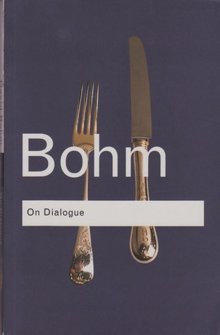
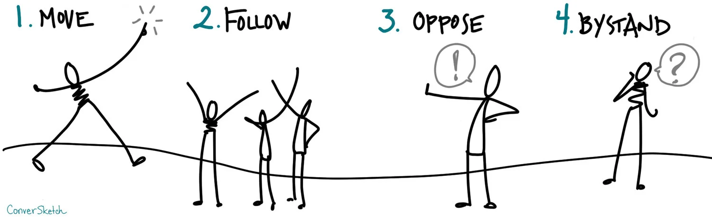

# Dialouge and The Power of Decision-Making
## Perception **|** Dialogue **|** Execution

---

# Thought Leaders Who Inspired This

  

    
    
Jafar Mossafa

  

  

    
    
David Bohm

  

  

    
    
David Kantor

  

---

# How Are Thoughts Made?
## The process behind our mental interpretations

---

# The Nature of Thought and Interpretation
Our thoughts shape how we interpret reality. Mohammadjafar Mosaffa’s work **"Excessive Thinking"** explores how our perceptions often distort the **truth**. Let’s dive into his ideas.

---

# Mohammadjafar Mosaffa

📖 Author, translator, and Rumi scholar.  
 
💡 Known for works like **"تفکر زائد"** 

---

# Excessive Thinking

## Interpretation vs. Reality
### What We Think vs. What Is Real
#### Opinion vs. Fact

---

| **What is**                  | **What we think**                      |
|----------------------------------|-------------------------------------------------|
| Apple is red.                    | "This apple is perfect for a healthy snack."    |
| Apple is there.                  | "This apple reminds me of my childhood."        |
| Apple is on the desk.            | "This apple is too sour."                       |
| Apple is round.                  | "This apple is overpriced."                     |
| Apple has a stem.                | "This apple represents temptation."             |

                           

---

# From Perception to Fragmentation
What we think is often far from what reality is. This gap in understanding is a key factor in the fragmentation of thought. David Bohm's work on fragmentation highlights how this division prevents us from seeing the whole picture.

---

# When the World Falls Apart
## Why We Prefer to Break Things Up

---

# Fragmentation and Its Impact on Decision-Making
Fragmented thoughts lead to decisions based on incomplete information. Dialogue, according to Bohm, helps connect these ideas and gives us a clearer, more complete view. This improves our decision-making.

---

# David Bohm  

📖 A theoretical physicist and philosopher.  
🔍 Explored **quantum theory** and the nature of thought.  
💡 Developed the concept of **Dialogue** to promote **deeper understanding** and collaboration.

---

---

# Fragmentation vs. Wholeness

---

# **Fragmentation**  

## 💡 We break things into pieces.

David Bohm believed our thinking divides reality into fragments. This limits understanding and prevents seeing how everything fits together.

---

# **What does fragmentation mean?**

- It’s when things are broken into disconnected fragment.

- Like focusing on fragments of a story without seeing the full picture.

---

# **The Broken Watch**

- Gears, Glass, Hands.

---

# Dialogue: Bridging the Gap
Dialogue helps us bridge gaps by sharing ideas and perspectives. It’s not about winning a debate, but about understanding each other and building meaning together.

---

# What is Dialogue?

Dialogue is when people share ideas and listen without defending their own views. It’s about understanding each other, suspending judgment, and creating meaning together. It’s not a debate—it’s about finding **shared understanding**.

---

## Suspension of Judgment

In meetings, listen to all ideas before forming an opinion. Let team members share thoughts on a new feature before deciding its worth.

---

## Whole-System Thinking

Think about how decisions affect the whole team. When planning a feature, consider how it impacts marketing, support, and sales, not just development.

---

## Co-Creation of Meaning

Encourage everyone to share ideas and build on them. Example: In planning, ask input from all teams to shape priorities together.

---

## Listening to Understand

Focus entirely on the speaker without planning your response. Listen fully when a colleague explains a problem, and only then offer your input.

---

# How Dialogue Works

## Exploration

Ask open-ended questions and avoid jumping to conclusions. In brainstorming, ask, “What if we tried this?” instead of dismissing ideas immediately.

---

## Flow of Thought

Let conversations unfold naturally without interruptions.In discussions, allow ideas to develop before narrowing down to the best solution.

---

## Collective Intelligence

More perspectives lead to better solutions. In strategic decisions, involve people from different departments to enrich your insights.

---

# How Dialogue Influences Decision-Making
The decisions we make are shaped by how well we communicate. Dialogue fosters a deeper understanding of different viewpoints, enabling us to make informed, collaborative decisions.

---

# The Power of Decision-Making

### 5 Ways to Lead Conversations
🔹 Understand who makes the final decision.  
🔹 Use the right approach for better communication.

---

# Decision-Making Framework

| **Type**          | **Accountability**  | **Intention**      | **Who Decides?**      |
|-------------------|---------------------|--------------------|-----------------------|
| **No Decision**   | Inform 🗣️          | Tell 📢            | No one yet            |
| **Your Decision** | Delegate 👥         | Guide 🧭           | The other person      |
| **My Decision**   | Consult 💬          | Listen & Ask 👂    | You                   |
| **Our Decision**  | Reach Consensus 🤝  | Facilitate Dialogue 💬 | Both (Consensus)      |
| **Each Decision** | Explore & Align 🔍  | Engage in Dialogue 🗨️ | Both, separately      |

---

### "No Decision" (Inform)  
✅ **You’re sharing info. No one decides yet.**  
💡 Example: *"I found some cool places for the weekend."*  
💡 Product Example: *"We’re exploring AI-generated playlists."*

---

### "Your Decision" (Delegate)  
✅ **You trust the other person to decide.**  
💡 Example: *"You pick where we go!"*  
💡 Product Example: *"Task the data science team with analyzing reactions to AI curation."*

---

### "My Decision" (Consult)  
✅ **You ask for input, but you decide.**  
💡 Example: *"What do you think of the beach? I’ll decide if we go."*  
💡 Product Example: *"Consult the legal team about user data handling before making a decision."*

---

### "Our Decision" (Consensus)  
✅ **You both discuss and decide together.**  
💡 Example: *"Let’s pick a place we both like."*  
💡 Product Example: *"Hold a cross-functional meeting to decide on the product's next step."*

---

### "Each Decision" (Dialogue)  
✅ **You make separate decisions but align them.**  
💡 Example: *"You pick the hotel, I’ll handle the activities."*  
💡 Product Example: *"Design picks the UI, engineering handles the infrastructure, while both ensure they align with the overall product vision."*

---

# Planning a weekend trip:

1️⃣ No Decision: Just sharing ideas
2️⃣ Your Decision: Letting your partner choose
3️⃣ My Decision: Asking for input, but making the final choice
4️⃣ Our Decision: Agreeing together
5️⃣ Each Decides: You pick hotels, they pick activities

---

# Let's play the roles
## How we behave in different sistuations

---

# David Kantor

📖 A psychologist and organizational consultant.  
🔍 Studied **team dynamics** and **communication patterns**.  
💡 Developed the **Four-Player Model** to help teams have **better conversations**.

---

# Enhancing Collaboration through Role Clarity

Effective collaboration requires understanding the roles people play in communication. David Kantor’s Four-Player Model helps teams navigate their conversations and make decisions based on each person's contribution.

---
 

## Kantor’s Four-Player Model

| **Role**             | **Description**         |
|----------------------|-------------------------|
| 🚀 **Mover**         | Initiates ideas         |
| ❌ **Opposer**       | Challenges ideas        |
| 👍 **Follower**      | Supports ideas          |
| 👀 **Bystander**     | Observes and reflects   |

---

# 🚀 **Mover**   
✅ **Initiates ideas or actions.**

💡 Example: *"Let’s focus on improving the user onboarding process to reduce churn."*

---

# ❌ **Opposer**   
✅ **Challenges ideas and raises concerns.**

💡 Example: *"I think onboarding isn’t the root problem. We need to focus on faster load times."*

---

# 👍 **Follower**   
✅ **Supports and builds on ideas.**

💡 Example: *"I agree with Opposer. We should address speed issues before improving onboarding."*

---

# 👀 **Bystander**   
✅ **Observes and reflects on the conversation.**

💡 Example: *"Both onboarding and speed are important, but let’s consider our resources and timeframe."*

---

## 🎤 **Q&A**  

**🚀 Thank You for Your Attention!**  
- What questions do you have?  
- Let’s discuss, collaborate, and build better products together.  

💬 *"Questions spark innovation. Let’s talk!"*

---

# Matthew Truth 
Product Manager with 99999+ years of experience

 

 
Dotin | RM Innovation | Zavié | Rey Branding | ParadiseHub | Avatech Accelerator | Ronevis | Parandeban | Press TV |  White-Tower Coffee Shop | McDonald's Malaysia

 ---

🙏 **Thank You for Being Part of This Journey!**

🧠 *"Great products are built by great conversations. Let’s start one!"*

---

# 🕊️💙🌻😇🙏
# @TruthOfMatthew
