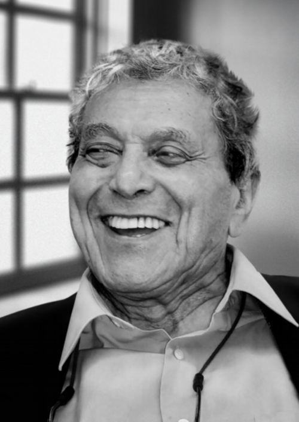

# Dialouge and The Power of Decision-Making  
## Perception **|** Dialogue **|** Execution

---

# Thought Leaders Who Inspired This

  

    
    
Jafar Mossafa

  

  

    
    
David Bohm

  

  

    
    
David Kantor

  

---

# The Nature of Thought  
## The process behind our mental interpretations  

Our thoughts shape how we interpret reality. Mohammadjafar Mosaffa’s work **"Excessive Thinking"** explores how our perceptions often distort the **truth**. Let’s dive into his ideas.

---

# Fragmentation vs. Wholeness  
**David Bohm’s View**  

We break things into pieces, distorting the full picture. Bohm's work teaches us that dialogue connects fragmented ideas and helps us see the whole.

---

# Dialogue: The Bridge  
**What is Dialogue?**  

Dialogue isn’t about winning; it’s about understanding. It’s about sharing, listening, and creating meaning together. Dialogue helps us build shared understanding, bridging gaps between fragmented thoughts.

---

# Decision-Making Framework  
**Five Types of Decisions**

| **Type**          | **Accountability**  | **Intention**      | **Who Decides?**      |
|-------------------|---------------------|--------------------|-----------------------|
| **No Decision**   | Inform 🗣️          | Tell 📢            | No one yet            |
| **Your Decision** | Delegate 👥         | Guide 🧭           | The other person      |
| **My Decision**   | Consult 💬          | Listen & Ask 👂    | You                   |
| **Our Decision**  | Reach Consensus 🤝  | Facilitate Dialogue 💬 | Both (Consensus)      |
| **Each Decision** | Explore & Align 🔍  | Engage in Dialogue 🗨️ | Both, separately      |

---

# Thank You for Your Attention!  
**Let's Build Better Products Together**  

💬 *"Questions spark innovation. Let’s talk!"*
